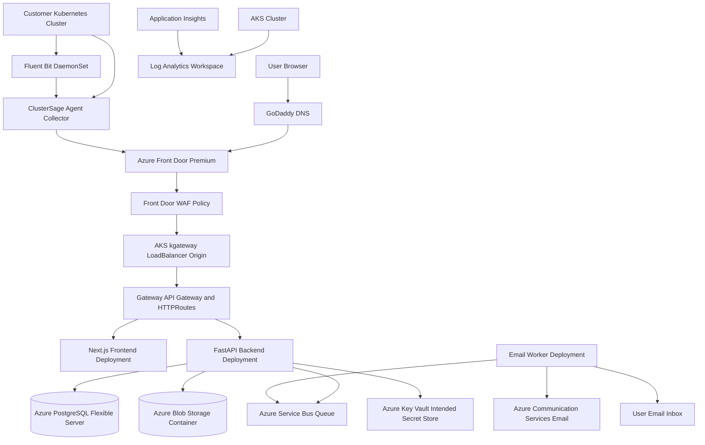

# Azure Architecture Review

This review is based on the repository contents as scanned: application code under `apps/`, collector code under `agent/`, Helm charts under `deploy/helm` and `agent/helm`, Kubernetes manifests under `deploy/k8s`, Terraform under `terraform/`, Dockerfiles, Docker Compose files, and existing documentation under `docs/`.

The repository currently uses the historical internal name `clusterwatch-*` in code, image names, database names, Helm resources, and Kubernetes resources. The user-facing product branding is now `ClusterSage`; older docs still contain `ClusterSage` and `ClusterWatch` references.

## 1. Repository Scan Summary

### Application Overview

ClusterSage is a multi-tenant Kubernetes observability SaaS platform using a customer-installed agent model.

The SaaS platform does not scan customer Azure subscriptions directly. Customers install a read-only Helm agent into their Kubernetes cluster. The agent runs inside the customer cluster, collects Kubernetes resource snapshots, events, and logs, and pushes data outward over HTTPS to the SaaS backend.

### Components Found

| Area | Files | Purpose |
| --- | --- | --- |
| Frontend | `apps/frontend` | Next.js dashboard for registration, login, cluster list, resource inventory, resource details, logs, settings, and install guide. |
| Backend | `apps/backend` | FastAPI API for auth, agent keys, agent registration, ingestion, audit logs, cluster/resource APIs, Service Bus event publishing, and email worker code. |
| Agent collector | `agent/collector` | Python collector running in customer clusters. Registers with SaaS API, sends heartbeat, snapshots, events, and logs. |
| Agent Helm chart | `agent/helm/clusterwatch-agent` | Customer-installed chart with collector Deployment, Fluent Bit DaemonSet, read-only RBAC, ServiceAccount, Secret, and Service. |
| Platform Helm chart | `deploy/helm/clusterwatch-platform` | SaaS platform chart for frontend, backend, email worker, migration job, services, Gateway API routes, optional Ingress. |
| Terraform | `terraform` | Azure infrastructure modules for RG, VNet, AKS, ACR, PostgreSQL, Storage, Key Vault, Front Door, WAF, Service Bus, Communication Services Email, monitoring, and identity. |
| Alternate deployments | `deploy/vm`, `deploy/vmss`, `infra/docker-compose.prod.yml`, `deploy/k8s` | Older or alternate deployment paths. Current production direction is AKS + Helm + Terraform. |
| Docs | `docs/*.md` | Architecture, storage, security, deployment, API, smoke tests, environment variables, and troubleshooting docs. |

No first-party GitHub Actions or Azure DevOps pipeline was found. CI/CD is therefore not currently codified in the repository.

### Current Deployment Model

The current implemented production shape is:

- Azure infrastructure provisioned by Terraform.
- Container images built into Azure Container Registry.
- SaaS platform deployed to AKS with Helm.
- Azure Front Door Premium with WAF as public entry point.
- Front Door origin points to the AKS kgateway external load balancer hostname.
- Gateway API routes traffic inside AKS:
  - `/health` and `/api/*` to backend
  - `/*` to frontend
- Backend stores metadata in PostgreSQL Flexible Server.
- Backend writes raw logs/events/snapshots to Azure Blob Storage.
- Backend publishes cluster-connected events to Azure Service Bus.
- Email worker consumes Service Bus and sends via Azure Communication Services Email.
- Customer clusters install the agent Helm chart and push outbound HTTPS to the SaaS API.

### Azure Resources Currently Used Or Expected

From Terraform:

| Azure resource | Terraform module | Current purpose |
| --- | --- | --- |
| Resource Group | `modules/resource-group` | Single environment resource group, currently `rg-clustersage-prod`. |
| VNet and subnet | `modules/networking` | AKS subnet only. |
| AKS | `modules/app-hosting` | Hosts frontend, backend, email worker, migrations, kgateway. |
| ACR | `modules/app-hosting` | Stores frontend, backend, and agent images. |
| Azure Front Door Premium | `modules/frontdoor` | Global HTTPS endpoint, custom domain, origin routing. |
| Azure Front Door WAF | `modules/waf` | Prevention mode, DefaultRuleSet, BotManagerRuleSet. |
| PostgreSQL Flexible Server | `modules/database` | Metadata database. |
| Storage Account + Blob container | `modules/storage` | Raw compressed logs, events, snapshots. |
| Key Vault | `modules/key-vault` | Intended secret store with RBAC enabled. |
| User-assigned Managed Identity | `modules/managed-identity` | Workload identity for AKS workloads. |
| Service Bus namespace + queue | `modules/service-bus` | `cluster-connected` notification events. |
| Azure Communication Services Email | `modules/email` | Sends cluster connected emails. |
| Log Analytics + Application Insights | `modules/monitoring` | Platform logs and application telemetry foundation. |

### Application Communication

| Flow | Current behavior |
| --- | --- |
| User to frontend | Browser reaches Azure Front Door custom domain, then kgateway, then `clusterwatch-frontend` service. |
| Frontend to backend | Frontend uses same origin when `NEXT_PUBLIC_API_URL` is empty; browser calls `/api/*` on the Front Door host. |
| Agent to backend | Customer collector posts to `/api/agent/register`, `/api/agent/heartbeat`, and `/api/ingest/*` using outbound HTTPS. |
| Backend to PostgreSQL | Async SQLAlchemy using `DATABASE_URL`. Current runtime uses a database connection string in Kubernetes Secret. |
| Backend to Blob Storage | Uses `AZURE_STORAGE_CONNECTION_STRING`; currently shared-key connection string based. |
| Backend to Service Bus | Supports connection string or Managed Identity. Current production wiring uses Workload Identity with fully qualified namespace. |
| Email worker to Service Bus | Uses Workload Identity to receive queue messages. |
| Email worker to ACS Email | Uses Workload Identity and `AZURE_COMMUNICATION_EMAIL_ENDPOINT`. |

### Current Security Posture

Strengths:

- Public ingress is centralized behind Azure Front Door WAF.
- Front Door WAF is in prevention mode with managed rules and bot rules.
- AKS has OIDC issuer and Workload Identity enabled.
- ACR admin user is disabled.
- AKS kubelet identity has AcrPull only.
- Service Bus and ACS Email use Workload Identity in production.
- Key Vault uses RBAC and purge protection.
- Agent keys are generated securely, shown once, and stored hashed.
- User passwords and agent keys are hashed with bcrypt.
- Agent RBAC is read-only and does not include Kubernetes Secrets.
- Backend has security headers, body-size limits, and basic in-process rate limiting.
- Storage container is private and blob paths include `orgId` and `clusterId`.

Gaps:

- PostgreSQL Flexible Server is not deployed with private endpoint or delegated private networking in the current Terraform. It has an `allow-azure-services` firewall rule.
- Storage Account has `shared_access_key_enabled = true`, and the backend currently requires `AZURE_STORAGE_CONNECTION_STRING`.
- Terraform creates Key Vault, but the Helm chart still consumes Kubernetes Secrets directly instead of Key Vault CSI Driver or External Secrets.
- Front Door origin currently uses HTTP to the AKS origin and disables certificate name checking at the origin.
- No Private Endpoints or Private DNS Zones are defined for PostgreSQL, Storage, Key Vault, Service Bus, or ACS.
- No Network Security Groups are defined in Terraform.
- No Azure Policy assignments are defined.
- No Defender for Cloud plan is defined.
- Backend JWT defaults are development values in code and examples; production must always override them.
- Frontend stores JWT in `localStorage`, which is vulnerable to token theft if an XSS bug is introduced.
- Backend API docs `/docs` and `/openapi.json` are enabled by default.
- Rate limiting is in-memory per pod, so it is not globally consistent across replicas.

### Current Scalability Posture

Strengths:

- AKS is a scalable hosting target.
- Frontend/backend/email worker are separate Kubernetes Deployments.
- Helm values support replica counts.
- Service Bus decouples notification email work from agent registration.
- Blob Storage can scale for raw ingestion payloads.

Gaps:

- AKS cluster autoscaler is not configured in Terraform.
- Horizontal Pod Autoscalers are not defined for frontend, backend, or email worker.
- Platform pods do not define CPU/memory requests/limits in the Helm chart.
- PodDisruptionBudgets are not defined.
- Backend rate limiting is in memory and per pod.
- PostgreSQL is created with a small burstable SKU by default (`B_Standard_B2s`) and no explicit zone HA.
- Storage is LRS, not ZRS or GRS.
- No KEDA scaling is defined for Service Bus-driven email worker.

### Current HA And Reliability Posture

Strengths:

- Azure Front Door is globally distributed.
- Front Door has health probes to `/health`.
- AKS node count default is 2.
- Helm chart has readiness probe for backend.
- PostgreSQL backups are enabled with 7-day retention.
- Service Bus queue has duplicate detection and max delivery count.
- Email failures do not block agent registration.

Gaps:

- AKS default node pool does not explicitly use Availability Zones.
- Backend/frontend do not have PodDisruptionBudgets.
- Frontend chart does not define readiness/liveness probes.
- Email worker has no liveness probe.
- PostgreSQL zone redundant HA is not enabled in current Terraform.
- Storage uses LRS, so a zonal storage failure has higher risk than ZRS.
- No documented restore drill, RTO, or RPO.
- No multi-region DR design.
- No explicit alert rules in Terraform.

### Current Cost Posture

Cost-conscious choices:

- Single-region deployment.
- Single AKS cluster.
- PostgreSQL burstable default SKU.
- Storage LRS.
- Log Analytics retention set to 30 days.
- Service Bus Standard, not Premium.
- ACR Standard, admin disabled.
- ACS Email Azure-managed domain avoids custom email domain setup initially.

Cost risks:

- AKS is more expensive operationally than Azure Container Apps for a small app, though it fits this Kubernetes-centric product.
- Front Door Premium and WAF have non-trivial monthly cost.
- Application Insights and Log Analytics can grow with verbose logs.
- Running AKS 24/7 for dev/staging would be wasteful.
- A future Application Gateway WAF behind Front Door would duplicate cost and complexity unless compliance requires it.

### Missing For Production Readiness

Highest priority items:

1. Move PostgreSQL, Storage, Key Vault, Service Bus, and monitoring dependencies to private access where practical.
2. Remove Storage shared-key dependency by adding Blob SDK Managed Identity support.
3. Use Key Vault CSI Driver or External Secrets for Kubernetes secrets.
4. Add HPA/KEDA, resource requests/limits, and PDBs.
5. Add AKS zone-aware node pools and cluster autoscaler.
6. Add PostgreSQL HA and a tested restore process.
7. Add Azure Monitor alerts and dashboards.
8. Add CI/CD with OIDC-based deployment identity, image scanning, Terraform plan/apply gates, and Helm promotion.
9. Add Azure Policy and Defender for Cloud baseline.
10. Decide domain strategy: keep `www.nexaflow.site` on Front Door and redirect apex, or move DNS to Azure DNS for apex alias.

## 2. Current Architecture



Current traffic is intentionally simple:

- Front Door handles public TLS, WAF, custom domain, and global edge entry.
- kgateway handles Kubernetes-native routing.
- Backend and frontend are separate services.
- Ingestion API is part of the same backend deployment.
- Email is asynchronous through Service Bus and an email worker.

## 3. Production Requirements

For this application, production-grade Azure architecture should satisfy:

| Requirement | What it means here |
| --- | --- |
| Security | Public traffic only through Front Door WAF, private PaaS access where practical, Workload Identity, Key Vault-backed secrets, least privilege RBAC, storage public access disabled, database not publicly reachable, audit logs retained. |
| Scalability | Scale frontend/backend horizontally, scale email worker from Service Bus depth, scale AKS node pools, use Blob Storage for large payloads, keep metadata in PostgreSQL. |
| High availability | Multi-instance pods, zone-aware AKS node pools, PDBs, zone-redundant PostgreSQL and Storage for production, health probes, backup and restore. |
| Reliability | Health checks, retries, Service Bus decoupling, monitored ingestion errors, rollback-friendly Helm deployments, tested migrations. |
| Observability | Log Analytics, Application Insights, AKS Container Insights, dashboard metrics, alerts for API errors, ingestion failures, queue dead letters, DB saturation, node health. |
| Cost optimization | Single region unless business requires DR, shared non-prod subscription, lower SKUs for dev/staging, autoscaling, short log retention in non-prod, avoid duplicate WAF layers. |
| Operational simplicity | Terraform for Azure resources, Helm for app release, GitHub Actions or Azure DevOps for promotion, avoid manual portal drift. |

## 4. Architecture Options Compared

### Option A: Simple Cost-Optimized Production Setup

Shape:

- One subscription.
- Separate resource groups for dev, staging, and prod.
- One shared ACR.
- One shared Log Analytics workspace.
- One production AKS cluster.
- Dev/staging can run locally, in smaller AKS namespaces, or in a smaller non-prod AKS cluster.
- Production has Front Door WAF, AKS, PostgreSQL, Storage, Key Vault, Service Bus, and ACS Email.

Benefits:

- Lowest governance overhead.
- Easy to implement from the current Terraform.
- Good for MVP and early demos.
- Cost is easy to control.

Drawbacks:

- Weaker blast-radius isolation.
- Mistakes in subscription-level RBAC or policy can affect all environments.
- Budgets and quotas are less clean.
- Non-prod and prod identities can become tangled.

Suitable for this app:

- Suitable for an MVP or solo/team project review.
- Not ideal once real customer data and paid customers are present.

### Option B: Environment-Separated Production Setup

Shape:

- One subscription.
- Separate resource groups and VNets per environment:
  - `rg-clustersage-dev`
  - `rg-clustersage-stg`
  - `rg-clustersage-prod`
- Separate AKS/PostgreSQL/Storage/Key Vault/Service Bus per environment.
- ACR and monitoring can be shared only if justified.

Benefits:

- Better isolation than Option A.
- Lower overhead than multi-subscription.
- Clearer Terraform workspaces or variable files.
- Good stepping stone to enterprise governance.

Drawbacks:

- Subscription-level blast radius still exists.
- Budgets and RBAC are less strong than separate subscriptions.
- Shared ACR/monitoring needs careful access control.

Suitable for this app:

- Good if one subscription is all that is available.
- Production-grade enough for a small SaaS if RBAC is disciplined.

### Option C: Multi-Subscription Enterprise Setup

Shape:

- Separate subscriptions for dev, staging, and prod.
- Optional shared platform/connectivity subscription.
- Azure Policy, budgets, RBAC, Defender, private DNS, and network controls applied per subscription.

Benefits:

- Strong blast-radius isolation.
- Cleaner budgets and cost ownership.
- Stronger governance and approvals.
- Production can have strict RBAC and policies without slowing dev.

Drawbacks:

- More expensive and operationally heavier.
- More Terraform backend/state and CI/CD complexity.
- More cross-subscription role assignments if sharing ACR or DNS.
- Overkill for an early-stage app unless customer/compliance pressure exists.

Suitable for this app:

- Justified later if ClusterSage is handling many customers, regulated data, or enterprise customer requirements.
- Too much for the current project unless the review explicitly requires enterprise landing zone depth.

### Option D: Hybrid Recommended Setup

Shape:

- Two subscriptions:
  - `sub-clustersage-nonprod`
  - `sub-clustersage-prod`
- Dev and staging separated by resource groups and VNets inside non-prod.
- Production isolated in its own subscription.
- Shared code, IaC modules, and CI/CD.
- Production has isolated AKS, PostgreSQL, Storage, Key Vault, Service Bus, ACS Email, Front Door WAF, and monitoring.
- Non-prod uses cheaper SKUs and shorter retention.

Benefits:

- Strong production blast-radius isolation without three full subscriptions.
- Keeps cost lower than enterprise landing zone.
- Allows dev/staging experimentation without production risk.
- Easy story for project review: production customer data is isolated, non-prod remains cost-conscious.

Drawbacks:

- More setup than one subscription.
- Requires deployment pipeline awareness of two subscriptions.
- Shared services must be chosen carefully.

Recommended for this app:

- Yes. This is the best balance for ClusterSage now.

### Option E: Enterprise Hub-Spoke Landing Zone

Shape:

- Connectivity subscription with hub VNet, Azure Firewall, VPN/ExpressRoute if required.
- Shared services subscription for ACR, DNS, monitoring, Key Vault patterns.
- Workload subscriptions for dev/staging/prod.
- Central policy, Defender, budgets, RBAC, and private DNS.

Benefits:

- Best for large enterprises.
- Strong governance and central network controls.
- Good for many apps and teams.

Drawbacks:

- High complexity.
- Higher cost.
- Requires platform team maturity.
- Unnecessary if this is one SaaS app with one AKS platform cluster.

Suitable for this app:

- Not recommended now.
- Consider only if ClusterSage becomes part of a larger enterprise Azure landing zone.

## 5. Subscription Strategy Comparison

| Strategy | Benefits | Drawbacks | Cost impact | Security isolation | Fit |
| --- | --- | --- | --- | --- | --- |
| One subscription, multiple RGs | Simple, cheapest governance, quick | Weakest blast-radius isolation | Lowest | Low to medium | OK for MVP |
| One subscription, separate VNets/RGs | Clear environment boundaries | Subscription-level RBAC still shared | Low to medium | Medium | Good if constrained |
| Two subscriptions: non-prod and prod | Strong prod isolation without too much overhead | More CI/CD and RBAC setup | Medium | High for prod | Recommended |
| Three subscriptions: dev, staging, prod | Very clear boundaries | More admin and cost | Medium to high | High | Useful later |
| Enterprise hub-spoke | Best governance at scale | Over-engineered for one app | Highest | Very high | Future only |

Final subscription recommendation:

- Use two subscriptions.
- Keep production isolated.
- Put dev and staging in non-prod with separate resource groups, VNets, Key Vaults, databases, and storage.
- Avoid three subscriptions until team size, compliance, or customer requirements justify it.

## 6. Service Choice Comparison

### App Service vs Container Apps vs AKS vs VMs

| Option | Pros | Cons | Decision |
| --- | --- | --- | --- |
| App Service | Simple, managed, good for web/API | Less natural for Helm/Gateway API, worker, Kubernetes product story | Not selected |
| Container Apps | Cost-effective, KEDA native, good for small services | Current repo is Helm/AKS/Gateway oriented; customer agent and platform chart already assume Kubernetes | Good future simplification candidate, not selected now |
| AKS | Matches Helm, Gateway API, kgateway, Kubernetes-focused product, background workers, agent image flow | More operational cost and responsibility | Selected |
| VMs/VMSS | Simple Docker Compose path exists | More patching, less cloud-native, weaker autoscaling and isolation | Not selected for final production |

### Azure Front Door vs Application Gateway vs Load Balancer

| Option | Pros | Cons | Decision |
| --- | --- | --- | --- |
| Azure Front Door Premium + WAF | Global edge, managed TLS, custom domains, WAF before VNet, good SaaS entry point | Premium cost | Selected |
| Application Gateway WAF + AGIC | Regional L7, WAF, AKS ingress integration | Duplicates Front Door WAF if used behind Front Door, more cost and debugging | Not selected now |
| Application Gateway for Containers | Azure-native Gateway API direction | Additional service and cost; current kgateway is working | Consider later |
| Azure Load Balancer only | Cheap L4 ingress | No WAF/L7 routing/TLS edge | Not sufficient |

### Azure Firewall vs NSG-Only Model

| Option | Pros | Cons | Decision |
| --- | --- | --- | --- |
| NSG-only | Lower cost, enough for simple private subnets | Less centralized egress filtering | Recommended now |
| Azure Firewall | Central egress control, FQDN rules, forced tunneling | Expensive for current scale | Future enterprise option |

### Public DB Access vs Private Access

| Option | Pros | Cons | Decision |
| --- | --- | --- | --- |
| Public DB with firewall | Easy, current Terraform | Larger attack surface, weak production posture | Current only, not final |
| Private Endpoint or VNet-integrated PostgreSQL | Stronger security, private traffic | Requires private DNS and subnet planning | Recommended |

### Single Region vs Multi-Region

| Option | Pros | Cons | Decision |
| --- | --- | --- | --- |
| Single region with zones | Cost-conscious, simpler | Regional outage requires restore/redeploy | Recommended now |
| Active-active multi-region | Strongest availability | Much higher cost and data consistency complexity | Future only |
| Warm standby | Better DR than backup-only | Extra infrastructure cost | Later, when RTO/RPO require it |

### Shared vs Isolated Resources

| Resource | Recommendation |
| --- | --- |
| Production PostgreSQL | Isolated |
| Production Storage | Isolated |
| Production Key Vault | Isolated |
| Production Service Bus | Isolated |
| Production AKS | Isolated |
| ACR | Either shared platform ACR with strict RBAC and immutable tags, or separate prod ACR. For simpler prod isolation, use separate prod ACR. |
| Monitoring | Separate prod workspace; non-prod can share one workspace. |
| Front Door | Prod Front Door isolated. Non-prod can use lower-cost direct endpoints or separate Standard/Premium as needed. |

## 7. Cost Optimization Analysis

Recommended cost decisions:

- Use two subscriptions instead of three.
- Keep dev/staging in one non-prod subscription.
- Use lower PostgreSQL SKUs in dev/staging.
- Use shorter Log Analytics retention in non-prod.
- Use AKS autoscaler and right-sized node pools.
- Keep Front Door Premium only for prod unless non-prod WAF testing is required.
- Avoid Application Gateway WAF behind Front Door until compliance requires it.
- Use Service Bus Standard, not Premium.
- Use ACS Email Azure-managed domain initially.
- Use Storage lifecycle rules for logs/events/snapshots.
- Set budgets and alerts per subscription and resource group.
- Consider scheduled shutdown for non-prod AKS or use Container Apps for ephemeral test environments later.

What must not be shared:

- Production database.
- Production storage account.
- Production Key Vault.
- Production Service Bus queue.
- Production AKS cluster.
- Production managed identities.

What can be shared carefully:

- Terraform modules.
- CI/CD pipeline templates.
- Non-prod Log Analytics workspace.
- Non-prod ACR, if image promotion is controlled.

## 8. Final Recommendation

Use the hybrid recommended setup:

```text
Two subscriptions:
  sub-clustersage-nonprod
  sub-clustersage-prod

Production:
  Azure Front Door Premium + WAF
  AKS with kgateway and Gateway API
  Azure PostgreSQL Flexible Server with private access and HA
  Azure Storage Account with private endpoint, public access disabled, lifecycle rules
  Azure Key Vault with RBAC, CSI/External Secrets integration
  Azure Service Bus Standard for cluster-connected events
  Azure Communication Services Email
  User-assigned Managed Identity with Workload Identity
  ACR with admin disabled
  Log Analytics + Application Insights + Azure Monitor alerts
```

Keep AKS for now because the repository is already Kubernetes-native:

- Platform is deployed by Helm.
- Customer agent is a Helm chart.
- Gateway API is used for routing.
- kgateway is already the in-cluster routing layer.
- Email worker and API can scale independently.
- The product story itself is Kubernetes observability.

Do not add Application Gateway WAF behind Front Door now. It adds duplicated WAF cost and operational complexity. Add it only when a customer, regulator, or enterprise platform standard requires regional WAF enforcement inside Azure.

## 9. Why This Is Not Over-Engineered

The recommendation is production-grade but still restrained:

- It uses two subscriptions, not three or a full enterprise hub-spoke landing zone.
- It keeps one production region with Availability Zones instead of active-active multi-region.
- It uses Front Door WAF as the only WAF layer.
- It keeps Service Bus Standard and ACS Email.
- It keeps AKS because the repo already depends on Kubernetes patterns.
- It avoids Azure Firewall until strict egress control is required.
- It improves private networking and identity without redesigning the application.

This gives a strong project-review story: secure public edge, private data plane, isolated production, reliable scale path, and cost-aware operations.

## 10. Review Talking Points

- "The platform follows a customer-installed agent model. We do not need Azure Lighthouse or customer subscription access."
- "The only public entry point is Azure Front Door Premium with WAF. AKS is not directly exposed as the product endpoint."
- "Front Door handles global TLS, custom domain, and edge WAF. kgateway handles Kubernetes-native service routing inside AKS."
- "The ingestion API and SaaS API currently run in the same FastAPI backend, while the email worker is a separate deployment."
- "Raw high-volume data is stored in Blob Storage; PostgreSQL stores metadata and indexes only."
- "Cluster-connected email is asynchronous through Service Bus, so email failures do not block agent registration."
- "Managed Identity and AKS Workload Identity are the preferred production access model."
- "The current implementation is working, but the final production target moves PostgreSQL and Storage to private access."
- "We are intentionally not adding Application Gateway WAF behind Front Door because it duplicates WAF cost and increases troubleshooting complexity."
- "The recommended subscription model is two subscriptions: non-prod and prod. Three subscriptions are not necessary yet."
- "Multi-region active-active is deferred until business RTO/RPO requirements justify the cost."

