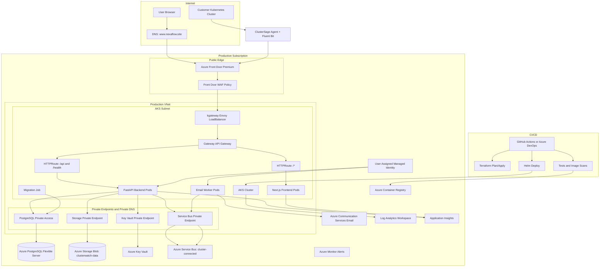

# Final Azure Architecture

This document defines the recommended final Azure architecture for ClusterSage, based on the actual repository structure and current deployment direction.

## 1. Architecture Overview

ClusterSage is a Kubernetes observability SaaS platform. Customers install a read-only agent in their Kubernetes clusters. The agent sends cluster telemetry outward to the SaaS backend. The SaaS platform hosts a Next.js frontend, a FastAPI backend, and an asynchronous email worker.

The recommended final architecture is:

```text
Users and customer agents
  -> DNS
  -> Azure Front Door Premium with WAF
  -> AKS kgateway LoadBalancer
  -> Gateway API HTTPRoutes
  -> frontend/backend/email worker
  -> PostgreSQL, Blob Storage, Service Bus, ACS Email, Key Vault
```

Production should run in its own subscription. Dev and staging should run in a separate non-prod subscription with cheaper SKUs and shorter retention.

## 2. Final Architecture Diagram



## 3. Environment Strategy

| Environment | Subscription | Isolation | Cost posture |
| --- | --- | --- | --- |
| Dev | Non-prod | Own resource group, optional shared non-prod AKS or Container Apps | Lowest SKUs, short retention, can be stopped/recreated |
| Staging | Non-prod | Own resource group and data stores; mirrors prod routing more closely | Medium SKUs, production-like tests |
| Production | Prod | Dedicated subscription, RG, VNet, AKS, DB, Storage, Key Vault, Service Bus | Production HA and monitoring |

Shared:

- Terraform modules.
- CI/CD templates.
- Non-prod monitoring workspace can be shared.
- Non-prod ACR can be shared if image promotion is controlled.

Isolated:

- Production AKS.
- Production PostgreSQL.
- Production Storage Account.
- Production Key Vault.
- Production Service Bus.
- Production managed identities.
- Production monitoring workspace.

Why this approach:

- One subscription is too weak for customer-facing production blast-radius isolation.
- Three subscriptions are unnecessary right now.
- Two subscriptions give strong production separation while keeping cost and operations reasonable.

## 4. Subscription And Resource Group Design

Recommended subscriptions:

```text
sub-clustersage-nonprod
sub-clustersage-prod
```

Recommended production resource groups:

| Resource group | Contents |
| --- | --- |
| `rg-clustersage-prod-platform` | AKS, ACR, managed identity, workload resources. |
| `rg-clustersage-prod-data` | PostgreSQL, Storage Account, private endpoints for data resources. |
| `rg-clustersage-prod-edge` | Front Door, WAF, DNS integration if moved to Azure DNS. |
| `rg-clustersage-prod-observability` | Log Analytics, Application Insights, alert rules, dashboards. |

Current Terraform uses one resource group (`rg-clustersage-prod`). The final design can either split modules across resource groups or keep one resource group initially and split later. For project review, the split-resource-group design is clearer for RBAC and cost ownership.

Naming convention:

```text
<service>-clustersage-<env>-<region or purpose>
```

Examples:

```text
aks-clustersage-prod-eastus
acrclustersageprod
pg-clustersage-prod
stclustersageprod
kv-clustersage-prod
sb-clustersage-prod
afd-clustersage-prod
```

## 5. Networking Design

### VNet Design

Production VNet:

```text
vnet-clustersage-prod: 10.42.0.0/16
```

Recommended subnets:

| Subnet | Purpose |
| --- | --- |
| `snet-aks-system` | AKS system node pool. |
| `snet-aks-user` | AKS user node pool for frontend/backend/worker. |
| `snet-private-endpoints` | Private endpoints for Storage, Key Vault, Service Bus, and optionally ACS dependencies. |
| `snet-postgres` | PostgreSQL delegated subnet if using VNet-injected PostgreSQL Flexible Server. |

### NSGs

Use NSGs to:

- Allow inbound only where required for AKS and private endpoints.
- Restrict east-west traffic where practical.
- Deny broad inbound from internet to private subnets.
- Allow AKS egress to required Azure control-plane endpoints.

### Private Endpoints And Private DNS

Recommended private access:

| Service | Private access |
| --- | --- |
| PostgreSQL Flexible Server | Prefer private networking or private endpoint/private DNS. |
| Storage Account | Private endpoint for Blob. |
| Key Vault | Private endpoint. |
| Service Bus | Private endpoint for production if supported by chosen SKU and networking model. |

Private DNS zones:

```text
privatelink.postgres.database.azure.com
privatelink.blob.core.windows.net
privatelink.vaultcore.azure.net
privatelink.servicebus.windows.net
```

### NAT Gateway

Add NAT Gateway if stable outbound IP is required for third-party allowlists or if AKS SNAT exhaustion appears. It is not mandatory for the current app, but it is a clean production addition for predictable egress.

### Public Ingress Path

Only Azure Front Door should be the public application entry point:

```text
Internet -> Azure Front Door WAF -> kgateway origin -> AKS services
```

The AKS kgateway LoadBalancer should be treated as an origin, not a user-facing URL. When feasible, restrict origin access to Front Door using origin authentication patterns or network controls.

### Private Internal Traffic Path

```text
Backend pod -> Private DNS -> Private Endpoint -> PostgreSQL/Storage/Key Vault/Service Bus
```

## 6. Ingress And Traffic Flow

### User To Frontend Flow

1. User opens `https://www.nexaflow.site`.
2. DNS resolves to Azure Front Door.
3. Front Door terminates TLS using managed certificate.
4. Front Door WAF inspects the request.
5. Front Door forwards allowed traffic to the kgateway origin.
6. kgateway Gateway API routes `/*` to `clusterwatch-frontend`.
7. Next.js frontend serves the dashboard.

### Frontend To Backend/API Flow

1. Frontend calls same-origin `/api/*`.
2. Browser sends request to Front Door.
3. WAF inspects request.
4. kgateway routes `/api/*` to `clusterwatch-backend`.
5. Backend validates JWT or agent token.
6. Backend reads/writes PostgreSQL, Blob Storage, and Service Bus as needed.

### Backend To Database Flow

1. Backend uses `DATABASE_URL`.
2. DNS resolves PostgreSQL private endpoint or private flexible server address.
3. Traffic remains on Azure private network.
4. PostgreSQL enforces TLS and authentication.
5. Metadata is read/written with organization-level filtering in the application.

### Backend To Blob Storage Flow

Current implementation:

```text
Backend -> Storage connection string -> Blob Storage
```

Recommended final:

```text
Backend pod -> Workload Identity -> Blob SDK DefaultAzureCredential -> Storage private endpoint
```

The code should be extended so `BlobWriter` and `BlobReader` can use Managed Identity when no connection string is provided.

### Admin/Developer Access Flow

Developers should not use shared admin keys.

Recommended:

1. Authenticate to Azure with Entra ID.
2. Use least-privilege Azure RBAC groups.
3. Use Azure Bastion or authorized CI/CD agents for private operations if private cluster access is enabled.
4. Use `az aks command invoke` or private endpoint access for AKS admin tasks.
5. Use Key Vault RBAC for secret read/write access.
6. Use break-glass accounts only for emergencies.

## 7. Compute Design

Chosen service: AKS.

Why AKS:

- The repository already has Helm charts for platform and customer agent.
- Gateway API and kgateway are active routing patterns.
- The product itself is Kubernetes-focused.
- Backend, frontend, email worker, and migration job fit Kubernetes deployment primitives.
- Future services, workers, and AI processors can be added cleanly.

Production AKS recommendations:

- Enable cluster autoscaler.
- Use at least two node pools:
  - system pool for system components
  - user pool for app workloads
- Use Availability Zones where available.
- Add HPA for frontend and backend.
- Add KEDA scaler for Service Bus email worker.
- Add resource requests/limits.
- Add PodDisruptionBudgets.
- Use Azure CNI or CNI Overlay according to IP planning.
- Keep OIDC issuer and Workload Identity enabled.

Deployments:

- Frontend: Next.js container, `clusterwatch-frontend`.
- Backend: FastAPI container, `clusterwatch-backend`.
- Email worker: same backend image, command `python -m app.workers.email_worker`.
- Migrations: Helm revision-scoped Job running Alembic.

Rollback:

- Roll back Helm release.
- Keep immutable image tags.
- Use database migration discipline: backward-compatible migrations first, destructive changes later.

## 8. Database Design

Selected service: Azure PostgreSQL Flexible Server.

Why:

- Application uses SQLAlchemy and PostgreSQL-specific UUID/JSONB models.
- Stores relational metadata, audit logs, cluster records, log indexes, issue records, and future AI metadata.

Production recommendations:

- PostgreSQL 16.
- Private networking.
- Zone-redundant HA for production.
- Backup retention at least 14 to 35 days depending on compliance.
- Enable point-in-time restore.
- Enforce TLS.
- Use a non-admin application user where possible.
- Monitor CPU, memory, storage, active connections, deadlocks, and slow queries.

SKU guidance:

| Environment | Suggested posture |
| --- | --- |
| Dev | Burstable, small storage, short retention. |
| Staging | Burstable or General Purpose small SKU, production-like schema. |
| Prod | General Purpose or Memory Optimized depending on workload, zone HA enabled. |

Current gap:

- Terraform currently uses a public-access pattern with an Azure-services firewall rule. Final production should move to private access.

## 9. Storage Design

Selected service: Azure Storage Blob.

Usage:

- Raw compressed logs.
- Raw compressed events.
- Full cluster snapshots.
- Future AI context files.

Container:

```text
clusterwatch-data
```

Path pattern:

```text
logs/orgId=<org_id>/clusterId=<cluster_id>/year=<yyyy>/month=<mm>/day=<dd>/hour=<hh>/batch_<uuid>.json.gz
events/orgId=<org_id>/clusterId=<cluster_id>/year=<yyyy>/month=<mm>/day=<dd>/hour=<hh>/events_<uuid>.json.gz
snapshots/orgId=<org_id>/clusterId=<cluster_id>/year=<yyyy>/month=<mm>/day=<dd>/hour=<hh>/snapshot_<uuid>.json.gz
```

Production recommendations:

- Disable public blob access.
- Disable shared-key access after code supports Managed Identity.
- Use private endpoint for Blob.
- Use ZRS for production in a single-region zone-aware design.
- Add lifecycle rules:
  - hot tier for recent logs
  - cool/archive for older raw payloads
  - delete after retention period if compliance permits
- Keep metadata indexes in PostgreSQL.

## 10. Secrets And Identity Design

### Managed Identities

Use one or more user-assigned managed identities:

| Identity | Purpose |
| --- | --- |
| `id-clustersage-prod-workloads` | Backend, email worker, migration job. |
| Optional separate identity | CI/CD deployments. |

### Workload Identity

AKS service account:

```text
system:serviceaccount:clusterwatch:clusterwatch-workloads
```

Pods using it:

- Backend.
- Email worker.
- Migration job.

Current implemented use:

- Service Bus sender/receiver.
- Azure Communication Services Email.

Recommended next use:

- Blob Storage Data Contributor.
- Key Vault Secrets User.

### Key Vault

Use Key Vault for:

- JWT secret.
- Agent token secret.
- Database credentials until managed database auth is implemented.
- Any third-party API keys.
- Future Azure OpenAI keys if used.

Integrate with Kubernetes using:

- Secrets Store CSI Driver, or
- External Secrets Operator.

Avoid storing long-lived production secrets directly in Helm values.

## 11. Security Design

### WAF

Use Azure Front Door WAF:

- Prevention mode.
- Default managed rules.
- Bot protection.
- Custom rules for rate-based restrictions, admin paths, and geo rules if needed.

Do not add Application Gateway WAF now. It is a future option if compliance requires regional WAF behind Front Door.

### TLS

- Browser to Front Door: HTTPS with managed certificate.
- Front Door to origin: prefer HTTPS if the origin supports correct certificate/SNI. Current implementation uses HTTP to origin.
- Backend to PostgreSQL: TLS.
- Backend to Azure PaaS: HTTPS/private endpoint.

### API Protection

Current:

- JWT bearer tokens for users.
- Agent bearer tokens for ingestion.
- Agent keys are hashed and shown once.
- In-process rate limits.
- Security headers.

Recommended:

- Distributed rate limiting at Front Door/WAF and/or Redis if needed.
- Disable `/docs` and `/openapi.json` in production or protect them.
- Consider moving browser auth from `localStorage` to secure HTTP-only cookies.
- Add audit queries and admin role model before enterprise customers.

### Azure Policy

Recommended policies:

- Deny public blob access.
- Require HTTPS/TLS minimum versions.
- Require private endpoints for data services in prod.
- Deny ACR admin enabled.
- Require resource tags.
- Require diagnostic settings on key services.

### Defender For Cloud

Enable at least:

- Defender for Containers for AKS.
- Defender for Storage for production storage.
- Defender for Databases if budget allows.

## 12. Scalability Design

Horizontal scaling:

- Frontend HPA on CPU/request metrics.
- Backend HPA on CPU, request latency, or custom metrics.
- Email worker KEDA scaler on Service Bus queue depth.

AKS scaling:

- Cluster autoscaler on user node pool.
- Separate node pool for system and app workloads.

Database scaling:

- Scale PostgreSQL vertically as metadata grows.
- Add indexes for common `organization_id`, `cluster_id`, and time-based queries.
- Consider read replica only when dashboard read load justifies it.

Storage scaling:

- Blob Storage handles raw payload volume.
- Lifecycle policies control long-term cost.

Queue scaling:

- Service Bus decouples cluster registration from email sending.
- Dead-letter queue alerts catch failures.

## 13. High Availability Design

Recommended HA choices:

| Layer | HA design |
| --- | --- |
| Front Door | Managed global edge. |
| AKS | Multiple nodes across Availability Zones, HPA, PDBs. |
| kgateway | At least two replicas if supported by installed controller values. |
| Frontend | At least two replicas in production. |
| Backend | At least two replicas in production. |
| Email worker | At least two replicas or KEDA min 1/max N. |
| PostgreSQL | Zone-redundant HA in production. |
| Storage | ZRS for production. |
| Service Bus | Standard for current needs; Premium only if strict isolation/performance is required. |

Regional DR:

- Start with single-region plus backups.
- Define RTO/RPO:
  - Suggested MVP RTO: 4 to 8 hours.
  - Suggested MVP RPO: 1 hour or backup-dependent.
- Add warm standby only after customer contracts require it.

## 14. Observability Design

Current foundation:

- Log Analytics Workspace.
- Application Insights resource.
- AKS `oms_agent`.

Recommended telemetry:

- Application Insights instrumentation for FastAPI and Next.js.
- Structured JSON logs from backend and worker.
- AKS Container Insights.
- Front Door access logs and WAF logs.
- PostgreSQL metrics and logs.
- Storage metrics.
- Service Bus queue metrics and dead-letter alerts.

Recommended alerts:

| Alert | Signal |
| --- | --- |
| API unhealthy | `/health` probe failures, 5xx rate. |
| Ingestion failures | `/api/ingest/*` 4xx/5xx spike. |
| Agent registration failures | `/api/agent/register` 401/5xx spike. |
| Queue stuck | Active messages over threshold. |
| Dead letters | Dead-letter count greater than 0. |
| Email worker down | Deployment unavailable. |
| DB pressure | CPU, memory, storage, connections. |
| AKS node issues | Node NotReady, pod restarts. |
| WAF blocks spike | Front Door WAF blocked requests anomaly. |
| Storage failures | Blob auth/server errors. |

## 15. CI/CD Design

No repository CI/CD pipeline was found. Recommended pipeline:

### Build Stage

1. Checkout repository.
2. Install frontend/backend dependencies.
3. Run lint and tests.
4. Build frontend/backend/agent images.
5. Scan images for vulnerabilities.
6. Push immutable tags to ACR.

### Infrastructure Stage

1. Terraform fmt and validate.
2. Terraform plan per environment.
3. Manual approval before prod apply.
4. Terraform apply with OIDC identity.

### Deploy Stage

1. Deploy dev automatically.
2. Deploy staging after dev success.
3. Run smoke tests:
   - `/health`
   - register/login
   - create agent key
   - agent registration
   - snapshot/log ingestion
   - Service Bus/email worker smoke test
4. Manual approval for prod.
5. Helm upgrade prod.
6. Verify rollout and public endpoint.

### Rollback

- Helm rollback to previous release.
- Repoint image tag only if needed.
- Keep database migrations backward-compatible.

## 16. Cost Optimization Design

Cost controls:

- Two subscriptions, not three.
- Single production region.
- Avoid duplicate WAF layers.
- Use lower SKUs in non-prod.
- Use AKS autoscaler.
- Use Log Analytics 30-day retention by default; shorter in non-prod.
- Use Storage lifecycle management.
- Use Service Bus Standard.
- Use ACS Email Azure-managed domain initially.
- Set budgets and alerts for prod and non-prod.
- Avoid Azure Firewall until required.
- Avoid active-active multi-region until contracts require it.

## 17. Failure Scenarios And Handling

| Scenario | Handling |
| --- | --- |
| One frontend pod fails | Kubernetes restarts pod; Service routes to remaining replicas. |
| One backend pod fails | Readiness probe removes pod; remaining replicas serve traffic. |
| One AKS node fails | Pods reschedule to another node; PDBs protect voluntary disruption. |
| One availability zone fails | Zone-aware node pools and ZRS/zone-redundant services reduce impact. |
| PostgreSQL primary fails | Zone-redundant HA promotes standby. |
| Storage access issue | Backend returns errors for ingestion reads/writes; alerts fire; retries can be added at agent/backend layer. |
| Service Bus issue | Registration still succeeds if email publish is handled as non-blocking; queue alerts detect backlog. |
| Email provider issue | Worker abandons messages; retries occur; dead-letter alerts catch persistent failure. |
| Bad deployment | Helm rollback; previous image tag remains available in ACR. |
| Secret rotation | Update Key Vault secret; CSI/External Secrets sync; rollout pods if needed. |
| Traffic spike | Front Door absorbs edge traffic; HPA and cluster autoscaler scale AKS; WAF/rate limits block abusive traffic. |
| Regional outage | Initial approach is restore/redeploy from backups; warm standby can be added later. |

## 18. Final Review Summary

This architecture is secure because:

- Public traffic enters through Front Door WAF.
- Production data services are private in the final design.
- Workload Identity removes long-lived Azure credentials for Service Bus and email.
- Key Vault is the source of secret truth.
- Agent access is scoped and read-only in customer clusters.

It is reliable and highly available because:

- Front Door is globally managed.
- AKS runs multiple replicas across zones.
- PostgreSQL uses HA in production.
- Storage uses ZRS in production.
- Service Bus decouples email from registration.

It is scalable because:

- Frontend and backend scale horizontally.
- Email worker scales from queue depth.
- AKS node pools autoscale.
- Blob Storage handles high-volume raw telemetry.
- PostgreSQL stores metadata rather than raw log volume.

It is cost-conscious because:

- It avoids unnecessary three-subscription and hub-spoke complexity.
- It avoids duplicate Front Door WAF plus Application Gateway WAF.
- It uses non-prod shared subscription and lower SKUs.
- It keeps multi-region DR as a later business decision.

It is production-grade without being over-engineered because it improves the exact current architecture rather than replacing it: Terraform remains the infrastructure model, Helm remains the deployment model, AKS remains the compute platform, Front Door remains the edge, and kgateway remains the Kubernetes-native router.

